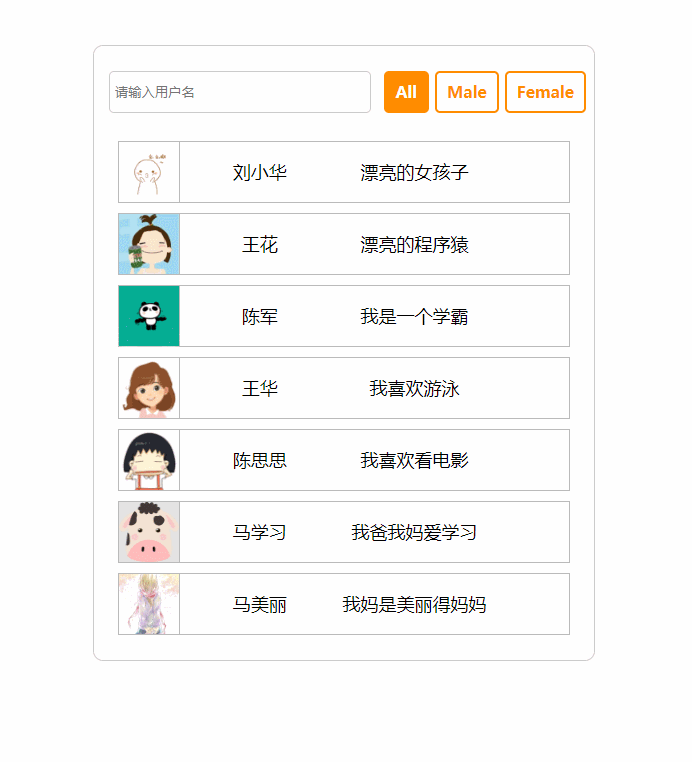

# 可筛选列表

## 思路

#### 文字筛选：
绑定input框输入事件，
使用indexOf()方法将输入的文字用来测试每一条数据中是否包含所输入的文本，返回筛选后数组</br>
#### 性别筛选：
使用addEventListener为列表添加点击事件，All,Male,Female的节点元素上添加对应sex属性，事件触发后获取对应sex属性。使用filter进行筛选
#### 多条件筛选
让点击和输入文字都触发多条件筛选函数。每次点击和触发后将对应值写入一个对象，然后链式的使用这个对象中的每一个属性进行筛选


## 效果展示

## 多条件筛选的实现

```javascript
//选择条件&实现函数
var stateFilter = {
    text: {
        value: '',
        func: filterText
    },
    sex: {
        value: 'all',
        func: filterSex
    }
}
/**
 * 叠加选择
 * 把多种属性一起拿来做筛选条件
 */
function addFunc(obj, arr){

    var lastArr = arr;
    for(var prop in obj){
        lastArr = obj[prop].func(obj[prop].value, lastArr);
    }

    return lastArr;
}
```

## filter方法总结
filter可实现筛选</br>
在filter中传入一个回掉函数，这个函数接受的第一个参数为数组中的每一项</br>
回掉函数对这一项进行判断， 返回true则把这个元素添加到被返回的新数组中</br>

```javascript
arr.filter(function(ele, index, arr){
    return true / false; 
})
```
返回的新数组与旧数组独立，但是不代表在filter的回掉函数中不可以改变原数组的引用类型值
```javascript
var arr = [ {name: 'a', age: 2},
			{name: 'b', age: 3},
			{name: 'c', age: 4},
			{name: 'd', age: 5},
			{name: 'e', age: 6}
		];
console.log(arr.filter(function(ele){
	return ele.age++;
}));
```
以上操作后原数组中的age都被加一

## 单选效果实现
```
//将被添加的选中类的类名置为空，然后将被选中的div的dom添加选中类名
document.getElementsByClassName('active')[0].className = '';
 e.target.className = 'active';
```

## JS中的字符串

单引号内可以加双引号，双引号内可以加单引号</br>
如果需要字符串拼接,可以使用这种方法,在每行末尾添加反斜杠

```javascript
'<li>\
    \
    <span class="name">'+ ele.name +'</span>\
    <span class="des">'+ ele.des +'</span>\
</li>'
```